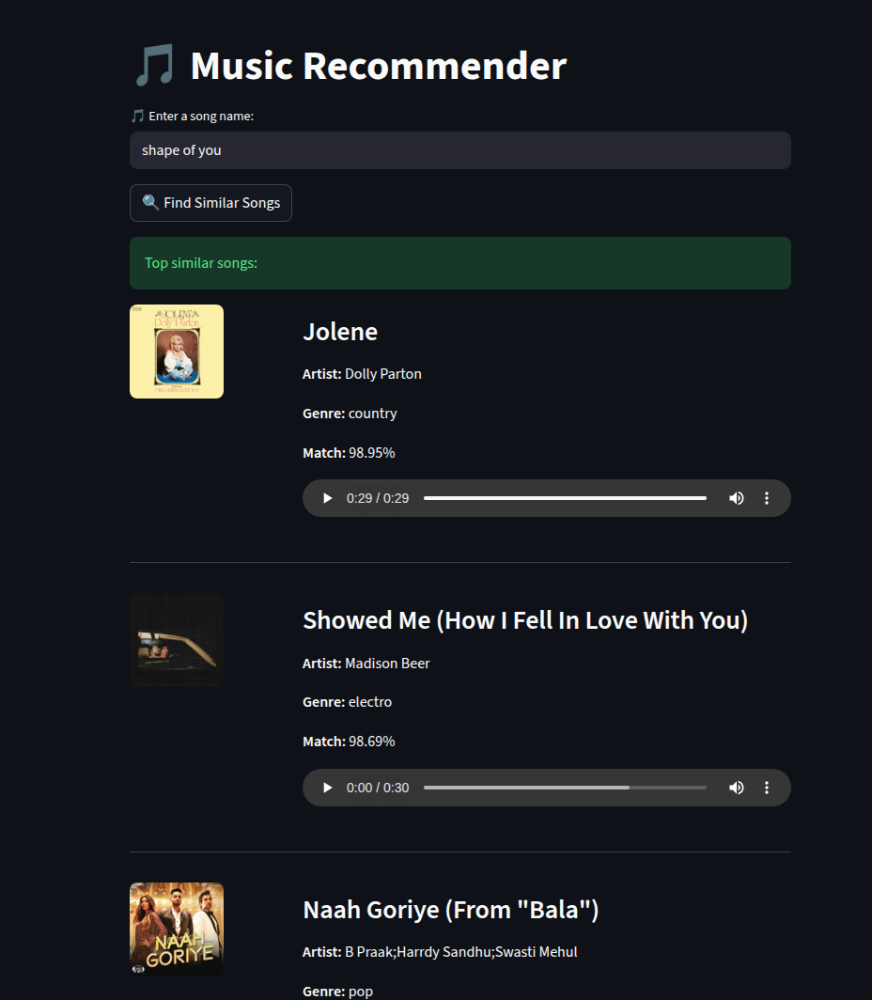

# 🎵 Content-Based Music Recommender System

A content-based music recommender system built with Python, Scikit-learn, and Streamlit. It recommends songs similar to a selected track by analyzing Spotify audio features such as danceability, energy, tempo, valence, and genre. The app integrates the Spotify API to display album artwork and direct Spotify links.

🔗 **Live Demo:** https://music-recom-system.streamlit.app/

---

## Demo



---

## Features

- Recommends songs based on audio characteristics using **Cosine Similarity**
- Interactive web application built with **Streamlit**
- Fetches album artwork and Spotify links using the **Spotify API**
- Feature engineering using normalized audio features and one-hot encoded genres
- Computes similarity only for the selected song — no need to store an 81K × 81K matrix

---

## Technology Stack

| Category | Tools |
|----------|-------|
| Programming Language | Python 3.9+ |
| Machine Learning | Scikit-learn |
| Data Processing | Pandas, NumPy |
| Frontend | Streamlit |
| API | Spotify API, Spotipy |
| Environment | python-dotenv |

---

## Project Structure

```text
music_recommender_system/
│── app.py                 # Streamlit application
│── recommend.py           # Recommendation engine
│── spotify_utils.py       # Spotify API helper functions
│── dataset.csv            # Spotify dataset
│── requirements.txt
│── README.md
│── demo.gif
│── .env                   # Spotify credentials (not uploaded to version control)
```

---

## Dataset

The project uses the Spotify Tracks Dataset containing more than **114,000 songs**.

Each song includes audio features such as:

- Danceability
- Energy
- Loudness
- Tempo
- Valence
- Speechiness
- Acousticness
- Instrumentalness
- Liveness
- Popularity
- Genre

After removing duplicates and cleaning the data, the recommendation engine works with approximately **81,000 unique tracks**.

---

## Prerequisites

- Python 3.9 or higher
- A [Spotify Developer account](https://developer.spotify.com/) to obtain API credentials

---

## Installation

**Clone the repository**

```bash
git clone https://github.com/KGaurav1207/music_recommender_system.git
cd music_recommender_system
```

**Create a virtual environment**

```bash
python3 -m venv venv
source venv/bin/activate       # On Windows: venv\Scripts\activate
```

**Install the required packages**

```bash
pip install -r requirements.txt
```

**Create a `.env` file** in the project root with your Spotify credentials:

```text
SPOTIFY_CLIENT_ID=your_client_id
SPOTIFY_CLIENT_SECRET=your_client_secret
```

> To get these credentials, create an app at [developer.spotify.com](https://developer.spotify.com/dashboard). Set any redirect URI (e.g. `http://localhost:8501`) when prompted.

**Run the application**

```bash
streamlit run app.py
```

---

## How It Works

1. The dataset is cleaned by removing duplicate songs and handling missing values.
2. Numerical audio features are normalized using **MinMaxScaler**.
3. Song genres are converted into numerical form using **One-Hot Encoding**.
4. The processed features are combined into a single feature matrix (81K rows × N features).
5. When a user selects a song, the system computes cosine similarity between that song and all others on the fly.
6. The most similar songs are ranked and displayed with album artwork and Spotify links.

---

## Challenges Faced

- **Memory constraints:** Computing an 81K × 81K similarity matrix requires over 50 GB of memory. Switched to on-demand computation — similarity is calculated only for the selected song.
- **Duplicate song titles:** Many tracks in the dataset share the same name (e.g. *Believer*). Added artist-based filtering to improve recommendation accuracy.
- **Feature balancing:** Combining continuous audio features with one-hot encoded genres required careful normalization to avoid any single feature dominating the similarity score.

---

## Future Improvements

- Hybrid recommendation system combining content-based and collaborative filtering
- Playlist-level recommendations
- Fuzzy search for song names
- Personalized recommendations based on listening history
- User accounts and saved preferences

---

## License

This project is licensed under the [MIT License](LICENSE).

---

## Author

**Kumar Gaurav Patel**

- GitHub: https://github.com/KGaurav1207
- LinkedIn: https://www.linkedin.com/in/kumar-gaurav-patel-73b149325/